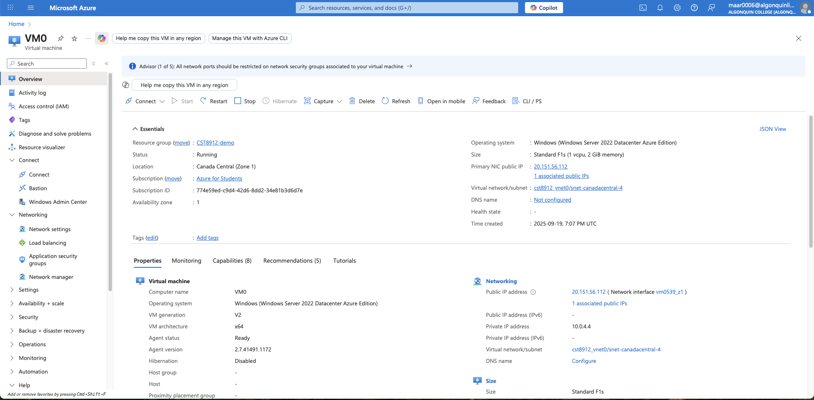

**Lab#2,** **CST8912,** **Ramy** **Maarouf,** **041-269-337**

> 1\. I created a new resource group named (CST8912-demo) under Azure
> services. This group acts as a logical container to manage all the
> related resources for this lab in one place, simplifying cleanup
> later.

> 2\. I created three separate virtual networks.
>
> ● cst8912_vnet0 in the Canada Central region.\
> ● cst8912_vnet1 in the Canada Central region.\
> ● cst8912_vnet2 in the West US 2 region.

> 3\. I assigned a unique, non-overlapping private IP address space to
> each VNet to prevent routing conflicts. The IP ranges used were
> 10.0.0.0/16, 10.10.0.0/16, and 10.20.0.0/16 respectively.
>

> 4\. I configured a VNet Peering connection between:
>
> ● cst8912_vnet0 (Canada Central) and cst8912_vnet1 (Canada Central).\
> ● cst8912_vnet0 (Canada Central) and cst8912_vnet2 (West US 2).\
> ● cst8912_vnet1 (Canada Central) and cst8912_vnet2 (West US 2).\
> ● I ensured that the peering was bi-directional for full connectivity.
>

> 5\. I deployed three Windows Server virtual machines to serve as test
> endpoints.
>
> ● VM0 was deployed into cst8912_vnet0.\
> ● VM1 was deployed into cst8912_vnet1.\
> ● VM2 was deployed into cst8912_vnet2.

> 6\. I used Remote Desktop Protocol (RDP) to connect to VM0.
>
> ● From VM0, I opened PowerShell to test the connections to VM1 and VM2
> using the Test-NetConnection command and their private IP addresses.\
> ● I successfully confirmed that TcpTestSucceeded returned True for the
> connection from VM0 to VM1 and from VM0 to VM2. This proves that the
> global and local peering connections are working correctly.

> 7\. I deleted the resource group CST8912-demo, which automatically
> removed all the virtual networks and virtual machines created for this
> lab.

**Why** **is** **VNet** **peering** **important?**

IT allows us to connect two or more virtual networks in Azure by
enabling resources within these separate VNets to communicate with each
other privately using their private IP addresses. This simplifies
network management, enhances security, and ensures efficient data
transfer.

**How** **was** **private** **IP** **communication** **established?**

VNet peering creates a direct, private connection between the VNets,
ensuring that all traffic is connected within this highly secure and
high-performance network. The use of private IP addresses for this
communication prevents exposure to the public internet, which is a key
security advantage.

**Benefits** **of** **Global** **Peering** **(Performance** **&**
**Security)?**

> ● **Performance:** Global peering offers a low-latency, high-bandwidth
> connection, which can be critical for applications requiring fast
> cross-region data transfer, such as disaster recovery and database
> replication.
>
> ● **Security:** Global peering provides a secure, private network
> connection. The traffic between regions never leaves the Azure
> network, so reducing the risk of interception or exposure. This is a
> vital security feature for organizations that need to maintain a high
> level of data privacy and integrity.
