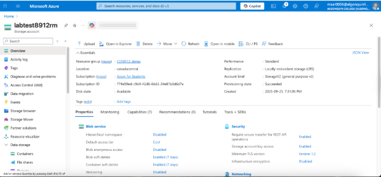
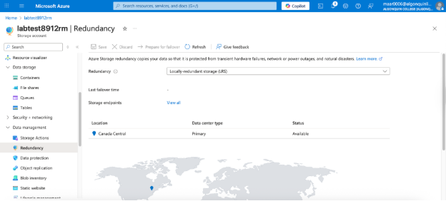
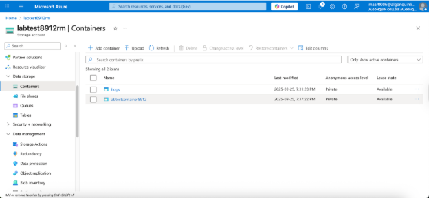
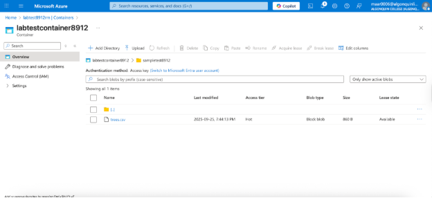
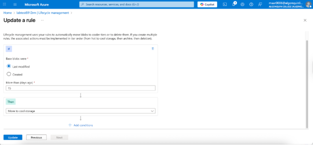
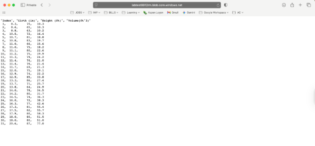

**Lab#3, CST8912, Ramy Maarouf, 041-269-337**

1.  Creating the Storage Account

2.  Modifying Redundancy

3.  Building Containers

4.  Uploading a blob

5.  Creating [Lifecycle Management Rule]{.mark}

6.  Testing private access

